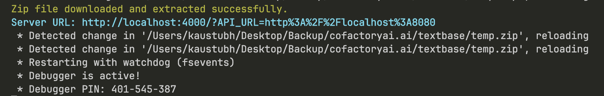

# Windows Virtual Assistant with Python and GPT-3

## Introduction

This project demonstrates how to create a virtual assistant for Windows using Python and GPT-3.5 Function-calling. With this virtual assistant, you can answer questions, and perform various actions on your Windows computer using natural language commands.

## Getting Started

### Prerequisites

- Python 3.x: [Python Downloads](https://www.python.org/downloads/)
- OpenAI GPT-3 API Key: Sign up for access at [OpenAI](https://beta.openai.com/signup/) and obtain your API key.

### Installation

Clone the repository and install the dependencies using [Poetry](https://python-poetry.org/) (you might have to [install Poetry](https://python-poetry.org/docs/#installation) first).

For proper details see [here]()

```bash
git clone https://github.com/sagnik6969/Windows-Virtual-Assistant-with-Python-and-GPT-3.5-Function-calling.git
cd Windows-Virtual-Assistant-with-Python-and-GPT-3.5-Function-calling
poetry shell
poetry install

```

## Start development server
>remember to set the OpenAI API key in `main.py`.

Run the following command:

    ```bash
    poetry run python textbase/textbase_cli.py test
    ```
Response:
```bash
Path to the main.py file: examples/openai-bot/main.py # You can create a main.py by yourself and add that path here. NOTE: The path should not be in quotes
```
Now go to the link in blue color which is shown on the CLI and you will be able to chat with your bot!


